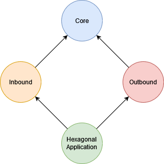

# HexagonalSpring
Simple Spring multimodule Maven project exposing an endpoint using hexagonal architecture.

## Compiling and Running
Using the included maven wrapper, run the following command to generate a JAR file:
```
./mvnw clean package
```

After this, there should be a compiled .jar file within the startup module's target folder:
```
java -jar ./hexagonalApplication/target/hexagonalApplication-0.0.1.jar
```

## Project structure:
The parent pom declares 4 modules: **inbound**, **outbound**, **core**, and the **hexagonalApplication** module. This last one contains the main class, e2e tests, and dependencies to the other modules just so that everything is propertly scanned and loaded upon startup. The core module does not depend on anything.

The inbound module contains the REST API controller layers and config, and the outbound module contains the persistence layer and JPA implementations. Through a dependency inversion against the core module, this last one consists exclusively of the business and service logic.
The final module structure is the following:
<p align="center">
    
</p>

## Testing
This project includes configured, ready to run e2e and integration testing dependencies. 

The core, inbound, and outbound modules all contain some minor **unitary tests** using **Mockito**.

The startup **hexagonalApplication** module contains **e2e tests** using **RestAssured**; and the **outbound** module also contains provider **integration tests** against the embedded H2 database.
